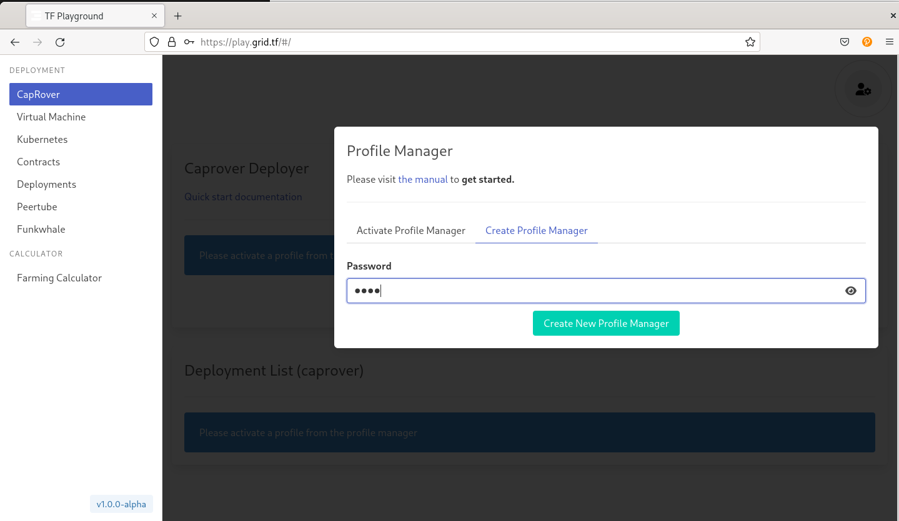
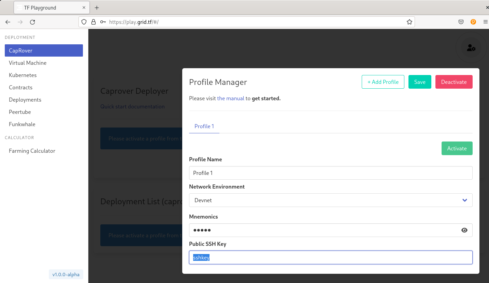
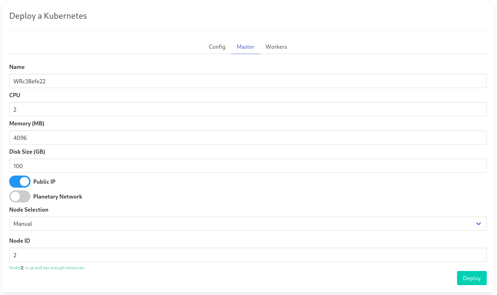

# Setup Threefold Kubernetes

You can easily setup Kubernetes clusters on Threefold. Threefold has 3 networks:

- Devnet (tokens are free): development network, we don't encourage users to actually use this network other then testing the deployments.
- Testnet (deployments are discounted by 90%!): testnet network, deployments are much cheaper but also prone to instability issues.
- Mainnet: main network, all the code running on this network is thoroughly tested and the safest to use.

## Step 1

Install polkadot js extension: https://polkadot.js.org/extension/

- Create an account an note your mnemonic (words).

## Step 2

Indentify which network you want to use. In this guide we will use `Devnet`.

## Step 3

Browse to https://portal.dev.grid.tf. Do the following things:

- Connect your polkadot js extension
- Enter your account and accept terms & conditions
- When you entered your account account, click on `create twin`. Use the default ip address provided: `127.0.0.1`
- Now you should see your wallet (it should have less then 0.1 TFT).

## Step 4

Get some more tokens on devnet!

Browse to https://polkadot.js.org/apps/?rpc=wss%3A%2F%2Ftfchain.dev.grid.tf%2Fws#/accounts and send some tokens from the Alice account to your own account (100 TFT will do). Please don't take to much :D.

## Step 5

You now have an account, you have tokens, time to deploy!!

Browse to https://play.grid.tf

Click on the right top account icon.

Click on create profile mananger and choose a password:



Next step:

- Fill in a profile name
- Select network enviroment: Devnet
- Fill in the mnemonic (words) that you generated with your polkadot account
- Fill in your public SSH key (this will be default for all deployments)



Click the green `Activate` button. Now you are ready to deploy.

## Step 6

On the left sidebar, select Kubernetes:

Now in this example we will deploy a single master kubernetes:

Select `Master` tab on the Kubernetes page:

. 

Use following values:

- CPU: 2
- Memory: 4096
- Disk size (GB): 100
- Public IP -> TRUE!!
- Node Selection: Manual
- Node ID: look for a node ID here: https://explorer.dev.grid.tf/nodes (it's an interger type)

If everything went well, you should see a screen containing the details of your Kubernetes deployment and also the public IP.

If you have the public IP you need to SSH to your cluster and copy the kubeconfig file to your host:

```
scp root@185.206.122.38:.kube/config config.yaml
export KUBECONFIG=~config.yaml
kubectl get pods
```

should give the output: `no pods in default namespace`.

You are now ready to deploy your Indexer!